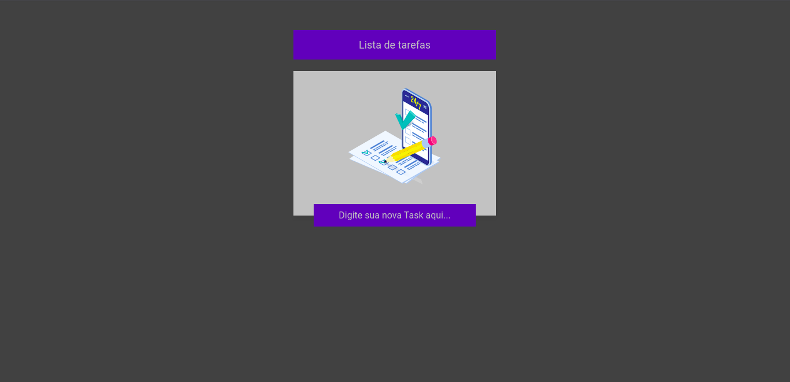
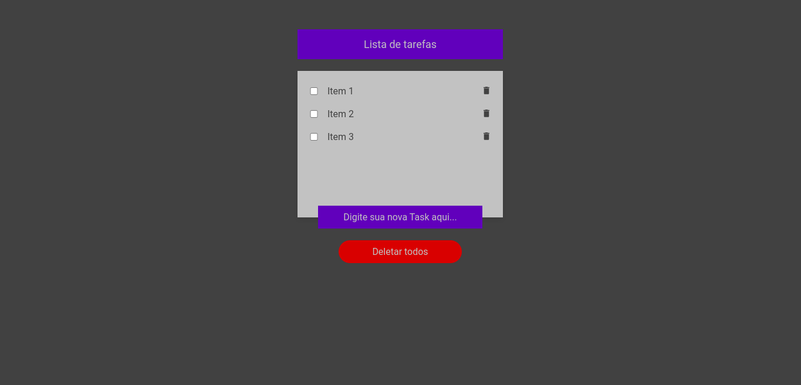
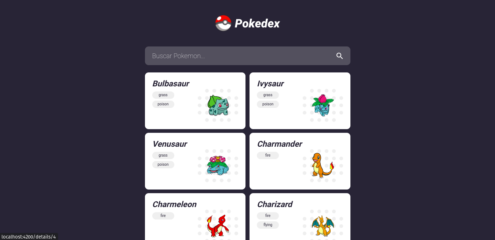
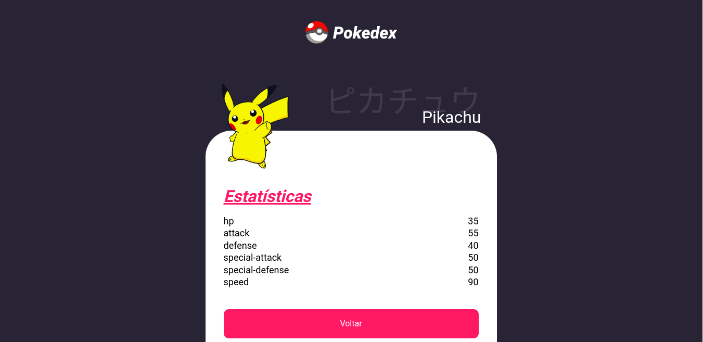
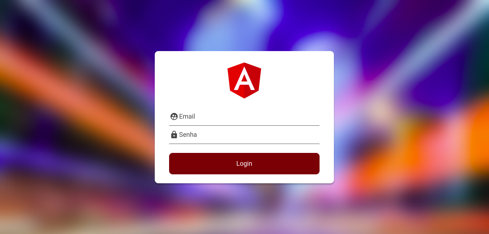
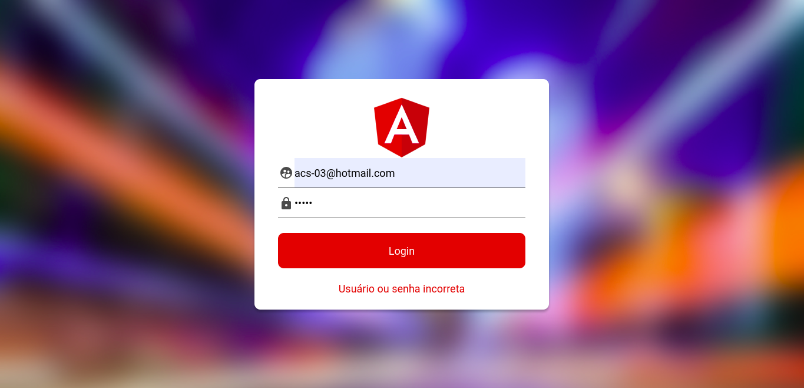
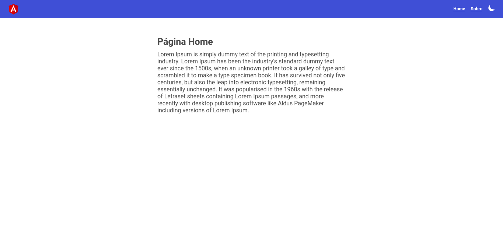
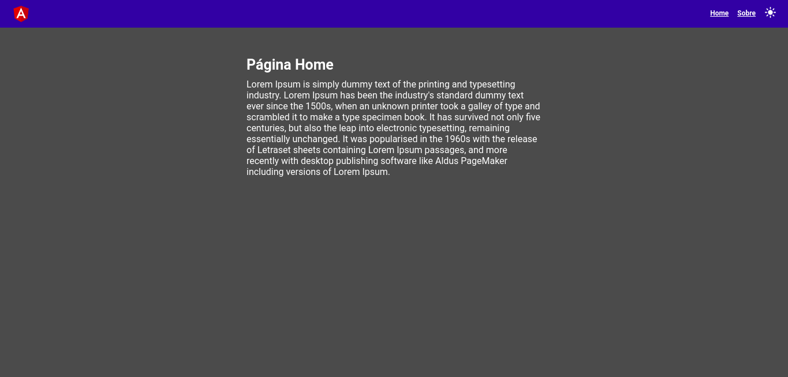

# Angular

Repositório destinado ao curso de Angular

- Versões
  - Angular: 15.2.8
  - Node: 16.20.0
  - Npm:8.19.4

## Conteúdo

- Componentes
- Data Biling
- Diretivas
- Módulos
- Comunicação entre Componentes
- Serviços, Http e Observable
- Forms
- Reactive Forms
- Rotas
- Teste Unitários (Karma e Jasmine)
- Guards
- Novidades Angular 14

## Projetos

### TO-DO List

1. Página inicial
   

2. Lista de itens
   

### Pokedex

1. Página inicial
   

2. Pesquisa de pokemon
   

### Auth

1. Página inicial
   

2. Dados incorretos
   

3. Página logado com sucesso
   

### Dark Theme

1. Página tema light
   

2. Página tema dark
   
